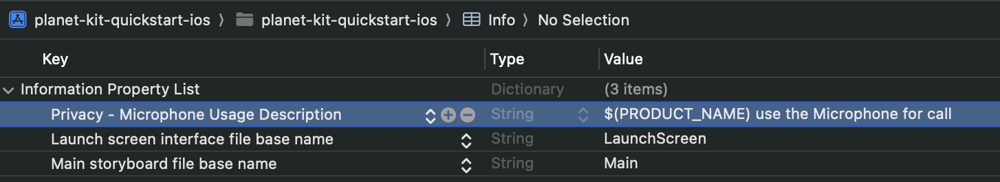
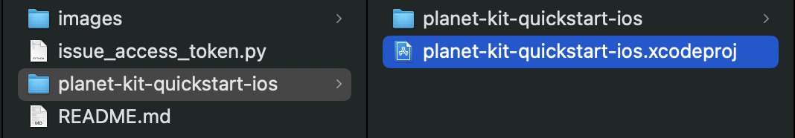
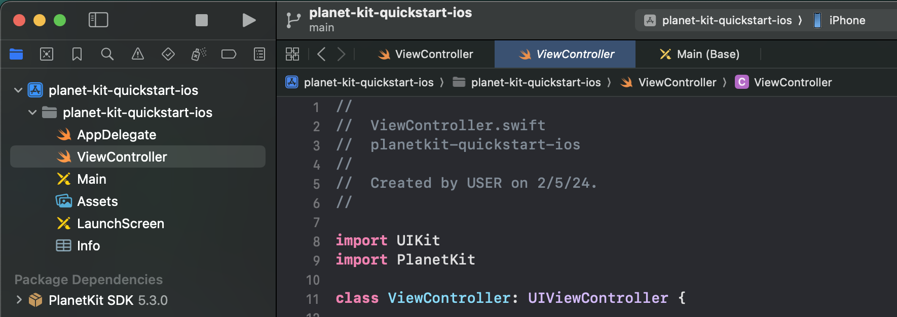
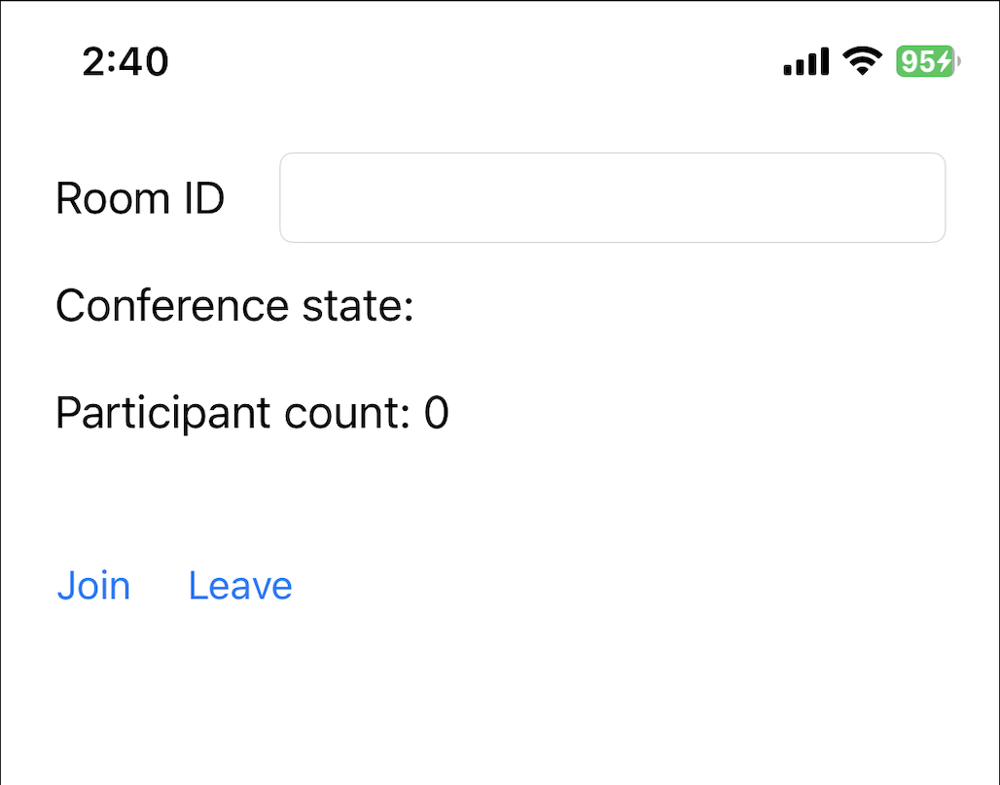

# PlanetKit quick start for iOS

This repository provides a quick start project implemented with PlanetKit for iOS.

> This quick start project is based on PlanetKit 5.4.x.

## About PlanetKit SDK

PlanetKit is a client SDK for LINE Planet, which is a cloud-based real-time communications platform as a service (CPaaS) that helps you build a voice and video call environment. With LINE Planet, you can integrate call features into your service at minimum cost.

### PlanetKit system requirements

The system requirements of PlanetKit for iOS are as follows.

#### Operating system requirements

- iOS 11.0 or higher

#### Required runtime permissions

- [`NSMicrophoneUsageDescription`](https://developer.apple.com/documentation/bundleresources/information_property_list/nsmicrophoneusagedescription)
- [`NSCameraUsageDescription`](https://developer.apple.com/documentation/bundleresources/information_property_list/nscamerausagedescription) (video call only)



### How to install the SDK

- [Installation](https://github.com/line/planet-kit-apple?tab=readme-ov-file#installation)

### References

- [PlanetKit system requirements](https://docs.lineplanet.me/overview/specification/planetkit-system-requirements)
- [API Reference](https://docs.lineplanet.me/api-reference/client/ios/5.4/index.html)

### Release information

- [API changelog](https://docs.lineplanet.me/iosmacos/reference/api-changelog)
- [Release notes](https://docs.lineplanet.me/iosmacos/reference/release-notes)

## Using the quick start project

This quick start project provides basic functionality of a **group audio call**.

### Prerequisites

- Xcode 14.1 or higher
- Python 3.8 or higher
  - To generate an access token, you need [a supported version of Python 3.x](https://www.python.org/downloads/), currently 3.8 or higher.

### 1. Download source code

Clone this repository, or download this repository and unzip the files.

### 2. Open the project

Open Xcode project `planet-kit-quickstart-ios.xcodeproj` with Xcode.



### 3. Generate an access token

> In this quick start project, we provide a script that generates an access token for your convenience. However, during the actual implementation of your app, the access token must be created in the AppServer. For more information, refer to [Access token](https://docs.lineplanet.me/getting-started/essentials/access-token).

Generate an [access token](https://docs.lineplanet.me/getting-started/essentials/access-token) using `generate_access_token.py`.

- The script requires a valid user ID as an argument. For the naming restrictions of a user ID, see [User ID](https://docs.lineplanet.me/overview/glossary#user-id).
- Python package requirement for `generate_access_token.py` can be found in `requirements.txt`.
  - You can use the command `pip3 install -r requirements.txt` to install required packages.

> We recommend using a virtual environment for this step. For more information, see [how to use venv](https://packaging.python.org/en/latest/guides/installing-using-pip-and-virtual-environments/).

```console
user@test planet-kit-quickstart-ios % python3 generate_access_token.py <YOUR_USER_ID>
access token:  <GENERATED_ACCESS_TOKEN>
```

### 4. Apply the user ID and the access token

Copy and paste the user ID and access token into your code.

```Swift
// ViewController.swift
class ViewController: UIViewController {
    let myUserId = PlanetKitUserId(id: "<YOUR_USER_ID>", serviceId: "planet-kit-quick-start")
    let accessToken = "<GENERATED_ACCESS_TOKEN>"
}
```

### 5. Run the project

Run the quick start project on an iOS device or iOS simulator with scheme `planet-kit-quickstart-ios`.



### 6. Join a group audio call

Enter a room ID and click **Join** to join the group call.

> To join the call successfully, you need to enter a valid room ID. For the naming restrictions of a room ID, see [Room ID](https://docs.lineplanet.me/overview/glossary#room-id).



One you're connected to the call, you can communicate with other participants. Click **Leave** to leave the group call.

## Troubleshooting

If the group call cannot be connected, please check [PlanetKitStartFailReason](https://docs.lineplanet.me/api-reference/client/ios/5.4/Enums/PlanetKitStartFailReason.html) and [PlanetKitDisconnectReason](https://docs.lineplanet.me/api-reference/client/ios/5.4/Enums/PlanetKitDisconnectReason.html).

```Swift
// check PlanetKitStartFailReason
// ViewController.swift
....
class ViewController: UIViewController {
    @IBAction func joinConference(_ sender: Any) {
        let param = PlanetKitConferenceParam(myUserId: myUserId, roomId: roomId, roomServiceId: roomServiceId, displayName: nil, delegate: self, accessToken: accessToken)
        let result = PlanetKitManager.shared.joinConference(param: param, settings: nil)

        NSLog("join conference result: \(result.reason)")
    }
}
```

```Swift
// check PlanetKitDisconnectReason
// ViewController.swift
....
extension ViewController: PlanetKitConferenceDelegate {
    func didDisconnect(_ conference: PlanetKitConference, disconnected: PlanetKitDisconnectedParam) {
        DispatchQueue.main.async {
            self.state = "disconnected"
            self.participantCount = 0
            NSLog("disconnected: \(disconnected.reason)")
        }
    }
}
```

## Issues and inquiries

Please file any issues or inquiries you have to our representative or [dl\_planet\_help@linecorp.com](mailto:dl_planet_help@linecorp.com). Your opinions are always welcome.

## FAQ

You can find answers to our frequently asked questions in the [FAQ](https://docs.lineplanet.me/help/faq) section.
